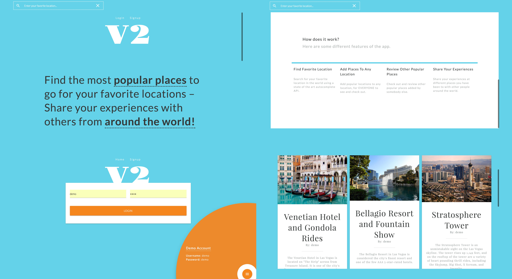

# I Need A Vacation V2
[I Need A Vacation V2](https://agile-brushlands-26553.herokuapp.com/) is a responsive full-stack app that allows users to post and check out other user submitted vacation places.

 

 ## Getting Started
 ### Installing
 ```
 > git clone https://github.com/coltonehrman/thinkful-node-capstone.git
 > cd thinkful-node-capstone
 > npm i
 ```
### Launching
```
> npm start
```
Then open [`localhost:3000`](http://localhost:3000) in your browser.
### Testing
```
> npm test
```

## Introduction
The main purpose of I Need A Vacation V2 was to turn a completely [front-end app](https://github.com/coltonehrman/thinkful-api-capstone) into a full-stack app. The new version of the app allows users to post their favorite vacations and see other people's favorite vacations.

## Technology
### Front-End
+ HTML5
+ CSS3/Sass
+ [Materialize CSS](http://materializecss.com/)
+ JavaScript
+ jQuery
+ [Google AutoComplete API](https://developers.google.com/places/web-service/autocomplete)
+ Webpack 2
### Back-End
+ Node.js + Express.js (Web Server)
+ MongoDB (Database)
+ Mocha + Chai + Sinon + Stubs (Testing)
+ Continuous integration and deployment with [Travis CI](https://travis-ci.org/)
### Responsive
+ The app is fully responsive and quickly adapts to all mobile, tablet, and desktop viewports.
### Security
+ User password are encrypted using [bcrypt.js](https://github.com/dcodeIO/bcrypt.js).
+ [Passport.js](http://passportjs.org/) is used to control user authentication on app endpoints.
